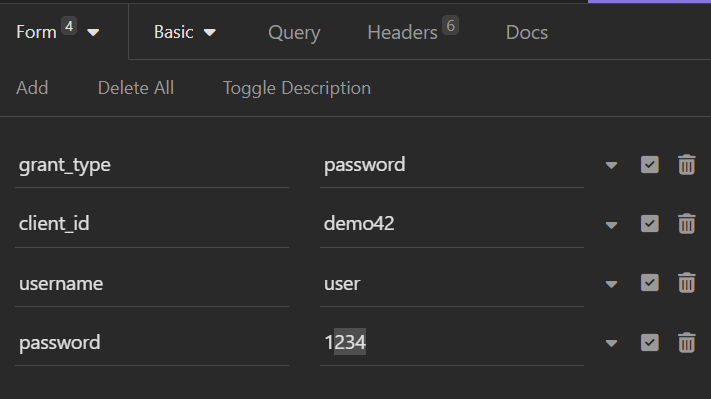

## Microservice Architecture Demo

# Introduction
Welcome to Microservice Architecture Demo Project. This project demonstrates how to build 
multiple microservices communicating with each other. The project contains the following 
modules:
1. A Spring Cloud Config server that is deployed as Docker container and can manage a services configuration information using a file system or GitHub-based repository.
2. A Eureka server running as a Spring-Cloud based service. This service will allow multiple service instances to register with it. Clients that need to call a service will use Eureka to lookup the physical location of the target service.
3. A API Gateway. All of our microservices can be routed through the gateway and have pre, response and post policies enforced on the calls.
4. A song service
5. A resource service.
6. A resource processor service, used to process song metadata.
7. A storage service
8. A Postgres SQL database used to hold the data for song service.
9. A postgres SQL database used to hold the data for resource service.
10. An authorization server to protect endpoints

## Initial Configuration
1.	Apache Maven (http://maven.apache.org)  All of the code in this repository have been compiled with Java version 11.
2.	Git Client (http://git-scm.com)
3.  Docker(https://www.docker.com/products/docker-desktop)


## How To Use

To clone and run this application, you'll need [Git](https://git-scm.com), [Maven](https://maven.apache.org/), [Java 11](https://www.oracle.com/technetwork/java/javase/downloads/jdk11-downloads-5066655.html). From your command line:

```bash
# Clone this repository
$ git clone https://github.com/Gbakradze94/microservice-architecture-demo.git

# Navigate to the parent directory 
# to build and run docker image
$ cd microservice-architecture-demo

# To build the code examples as a docker image, open a command-line 
# window and execute the following command:
$ mvn clean package dockerfile:build

# Now we are going to use docker-compose to start the actual image.  To start the docker image, stay in the directory containing  your chapter 8 source code and  Run the following command: 
$ docker-compose -f docker/docker-compose.yml up
```

# The build command

Will execute the [Spotify dockerfile plugin](https://github.com/spotify/dockerfile-maven) defined in the pom.xml file.  

 Running the above command at the root of the project directory will build all of the projects.  If everything builds successfully you should see a message indicating that the build was successful.

# The Run command

This command will run our services using the docker-compose.yml file located in the /docker directory. 

If everything starts correctly you should see a bunch of Spring Boot information fly by on standard out.  At this point all of the services needed for the chapter code examples will be running.

# Localstack
## To start localstack, from the main project directory run:
docker-compose -f docker-compose-localstack.yml up -d --build

To create a bucket on localstack aws s3 instance:
aws --endpoint-url=http://localhost:4572 s3 mb s3://resource-service

To run localstack image for local environment:
docker run -e "SERVICES=s3:4566" -e "DEFAULT_REGION=us-west-2" -p 4566:4566 localstack/localstack

* To put public acl on bucket:
awslocal s3api put-bucket-acl --acl=public-read-write --bucket=resource-service

## Module descriptions and usage guides
* Authorization Server: This module has a single controller with http POST handler method, 
which is used to authenticate the user. <br/>
In order to authenticate, make an 
HTTP POST request to the endpoint 'localhost:9000/api/auth/oauth/token',
with the following details (Using Insomnia API), Form-Url-Encoded headers:

</br>
Credentials for USER role (Login: user, Password: 1234)
<br/>
Credentials for ADMIN role (Login: admin, Password: 1234)
<br/>
Use Basic authorization with login: demo42, and password: demo42secret.

After sending an HTTP POST request on the endpoint above, with
described information, the JSON response will look like
the following:
```json
{
  "access_token": "08583a2e-a650-4d99-8201-fa611e11c33f",
  "token_type": "bearer",
  "refresh_token": "acdcf778-9ec9-4b6a-bac3-4b4d37a53ac7",
  "expires_in": 43199,
  "scope": "read write"
}
```
<br/> access_token must be passed 
when making requests to storage-service
<br/>
* Logging and monitoring - Prometheus and Grafana are used for logging
and monitoring. To log into Grafana, navigate to 
http://localhost:3000

## Set up Grafana's data source

You can login to Grafana by `admin/admin`.
You set up prometheus data source as follows.

|item| value |
|---|-----|
|Type|Prometheus|
|URL|http://localhost:9090|
|Access|direct|
|Scrap interval|5s|

<br/>
To use prometheus, navigate to http://localhost:9090/graph

# Database
You can find the database script as well in the docker directory.

## Contact

I'd like you to send me an email on <Bakradzegeorge17@gmail.com> about anything you'd want to say about this software.

### Contributing
Feel free to file an issue if it doesn't work for your code sample. Thanks.